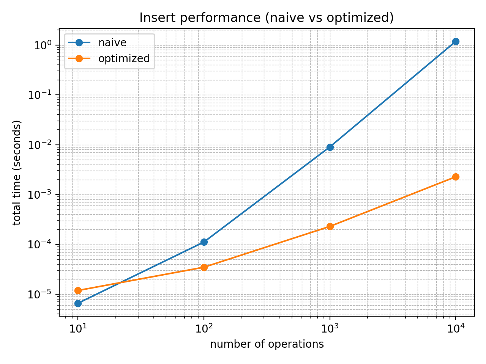
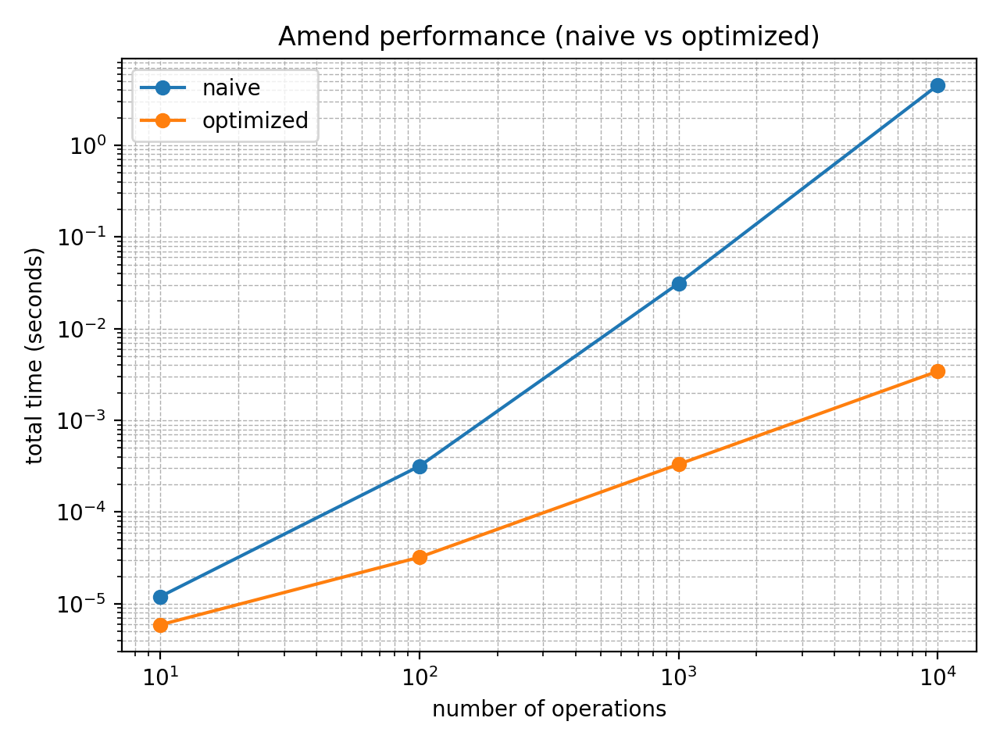
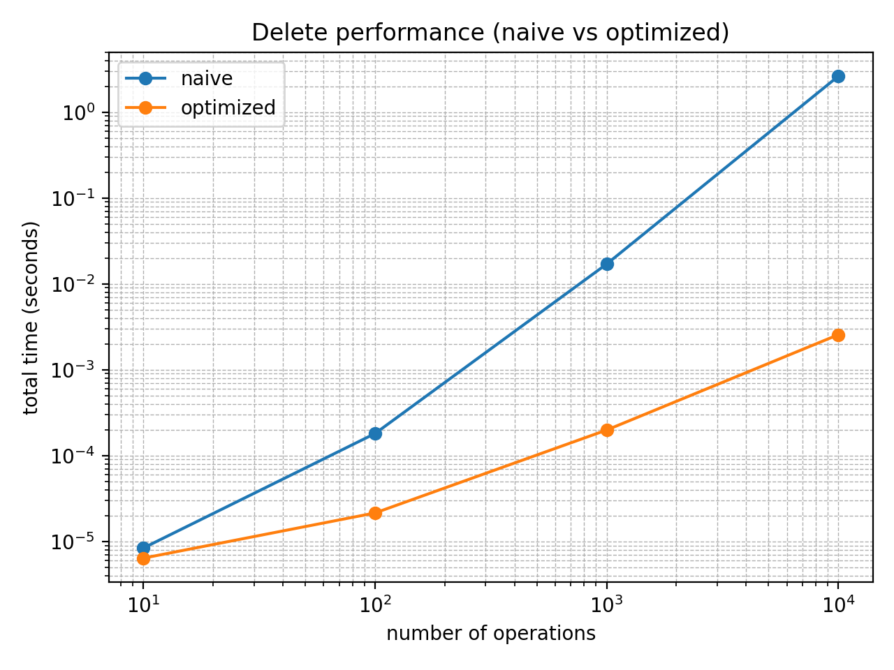

# Performance Comparison Report: Naïve vs Optimized Limit Order Book

**Author:** Pavlos Giannakis  
**Repository:** `lob-benchmark`  
**Timing method:** `time.perf_counter()`  
**Figures:** log–log axes (N vs total time)

---

## 1. Objective

This assignment evaluates how the choice of data structures impacts the runtime performance of a limit order book (LOB). Two implementations are compared: a baseline (“naïve”) version that stores orders in Python lists and re-sorts after every update, and an optimized version that uses hash-based indexing for direct lookup and heaps for best bid/ask retrieval. The benchmark focuses on three workloads—insert, amend, and delete—measured across increasing operation counts. The final output consists of timing tables and charts, together with an explanation of scaling behavior and the point at which the baseline approach becomes impractical.

---

## 2. Implementations

### 2.1 Naïve order book

The naïve implementation stores bids and asks in two separate lists. Each order is a dictionary with fields `order_id`, `price`, `quantity`, and `side`. The lists are maintained in sorted order by price by performing a full re-sort after every update. Specifically, bids are sorted in descending order of price and asks are sorted in ascending order of price. As a result, best bid and best ask are always available as the first element of the corresponding list.

Amend and delete are implemented by scanning the relevant list(s) to find the target `order_id`. After the quantity change (amend) or removal (delete), the entire side is re-sorted to re-establish price ordering, even though quantity does not affect order priority in this simplified model.

### 2.2 Optimized order book

The optimized implementation is designed around three goals: constant-time lookup by `order_id`, fast retrieval of all orders at a given price level, and efficient best bid/ask queries without global re-sorts. It maintains an `orders_by_id` dictionary mapping `order_id` to the order dictionary, enabling O(1) average lookup. It also maintains `bid_levels` and `ask_levels` dictionaries mapping `price` (stored as integer cents) to a list of orders at that price. This makes “retrieve all orders at a price” proportional to the number of orders at that price rather than the entire book.

Best bid and best ask are handled using heaps: a bid heap storing `-price` to simulate a max-heap via `heapq`, and an ask heap storing `price` as a standard min-heap. When a price level becomes empty, the corresponding heap entry may remain; the implementation uses lazy cleanup by popping stale heap entries when best bid/ask is queried, until the top corresponds to a non-empty price level.

---

## 3. Complexity analysis

Let \(n\) denote the number of orders on one side of the book, \(m\) the number of active price levels, and \(k\) the number of orders at a particular price level.

| Operation | Naïve | Optimized |
|---|---:|---:|
| Insert | \(O(n \log n)\) (full sort per update) | \(O(\log m)\) when new level + \(O(1)\) dict/list updates |
| Amend quantity | \(O(n) + O(n \log n) = O(n \log n)\) | \(O(1)\) average (direct dict update) |
| Delete | \(O(n) + O(n \log n) = O(n \log n)\) | \(O(k)\) to remove within a level list + amortized heap cleanup |
| Lookup by ID | \(O(n)\) | \(O(1)\) average |
| Orders at price | \(O(n)\) | \(O(k)\) |
| Best bid/ask | \(O(1)\) after sorting | amortized \(O(1)\) (heap top with lazy popping) |

The main theoretical difference is that the naïve implementation repeatedly pays a global sort cost on updates, while the optimized implementation avoids re-sorting the entire book and instead relies on indexing plus localized maintenance.

---

## 4. Benchmark methodology

For each workload size \(N\), \(N\) synthetic orders are generated using a fixed random seed for repeatability. Prices are discrete integers (cents) to avoid floating-point equality issues in dictionary keys. Insert benchmarks measure the time to insert \(N\) orders. Amend and delete benchmarks first build a book by inserting \(N\) orders, then amend/delete all \(N\) orders using randomized order IDs. Total time is measured with `time.perf_counter()`, and average time per operation is computed as total time divided by \(N\).

The optimized implementation was benchmarked through \(N = 1{,}000{,}000\). The naïve implementation was benchmarked through \(N = 10{,}000\); beyond that point, repeated global sorts make runtime impractical for typical development machines, and the performance trend is already evident in the measured range.

---

## 5. Measured timing tables

### Naïve (measured up to 10,000)

| N | Insert total (s) | Insert avg (s/op) | Amend total (s) | Amend avg (s/op) | Delete total (s) | Delete avg (s/op) |
|---:|---:|---:|---:|---:|---:|---:|
| 10 | 0.000007 | 6.999995e-07 | 0.000011 | 1.149997e-06 | 0.000008 | 8.200004e-07 |
| 100 | 0.000110 | 1.102000e-06 | 0.000361 | 3.612000e-06 | 0.000175 | 1.747000e-06 |
| 1,000 | 0.008627 | 8.627400e-06 | 0.031401 | 3.140060e-05 | 0.017297 | 1.729670e-05 |
| 10,000 | 1.191695 | 1.191695e-04 | 4.510270 | 4.510270e-04 | 2.607016 | 2.607016e-04 |

### Optimized (measured up to 1,000,000)

| N | Insert total (s) | Insert avg (s/op) | Amend total (s) | Amend avg (s/op) | Delete total (s) | Delete avg (s/op) |
|---:|---:|---:|---:|---:|---:|---:|
| 10 | 0.000018 | 1.769996e-06 | 0.000007 | 7.299997e-07 | 0.000013 | 1.309998e-06 |
| 100 | 0.000039 | 3.870000e-07 | 0.000032 | 3.239996e-07 | 0.000037 | 3.739999e-07 |
| 1,000 | 0.000301 | 3.008000e-07 | 0.000354 | 3.541000e-07 | 0.000370 | 3.696000e-07 |
| 10,000 | 0.002539 | 2.539300e-07 | 0.003896 | 3.895600e-07 | 0.004198 | 4.198000e-07 |
| 100,000 | 0.021783 | 2.178250e-07 | 0.049826 | 4.982630e-07 | 0.110611 | 1.106115e-06 |
| 1,000,000 | 0.217022 | 2.170221e-07 | 0.678434 | 6.784339e-07 | 10.947801 | 1.094780e-05 |

---

## 6. Required charts

### Insert performance (naïve vs optimized)

### Amend performance (naïve vs optimized)

### Delete performance (naïve vs optimized)

---

## 7. Discussion

The results show a clear separation in scaling behavior between the two approaches. Even by \(N = 10{,}000\), the naïve implementation spends substantial time in repeated sorting, which dominates the runtime for insert, amend, and delete. In contrast, the optimized implementation avoids global re-sorts by using constant-time indexing and price-level grouping, with heaps used only for best-price queries.

A direct comparison at \(N = 10{,}000\) illustrates the magnitude of improvement in total time. Insert time improves from 1.191695 s (naïve) to 0.002539 s (optimized), a speedup of approximately 469×. Amend improves from 4.510270 s to 0.003896 s, approximately 1158×. Delete improves from 2.607016 s to 0.004198 s, approximately 621×. These differences are consistent with the theoretical complexity gap between global re-sorts and hash/heap-based maintenance.

One notable behavior appears in the optimized delete at very large \(N\). At \(N = 1{,}000{,}000\), delete time increases substantially relative to insert and amend. This is explained by the implementation detail that each price level stores a *list* of orders; deleting an order requires searching within that list, which is \(O(k)\). Because prices are discrete, many orders can accumulate at the same price level, increasing \(k\) and making deletes slower at scale. A natural refinement would replace each level list with a dictionary keyed by `order_id` (or store direct node references), which would reduce per-level delete to O(1) average.

---

## 8. Conclusion

This benchmark demonstrates that a list-based LOB with re-sorting after every update does not scale, while an indexed approach using dictionaries and heaps enables high-volume workloads. The optimized implementation supports benchmarks up to one million operations with dramatically improved performance, and the remaining bottleneck observed in large-scale deletes is attributable to an \(O(k)\) search within price-level lists, suggesting a clear direction for further optimization.

